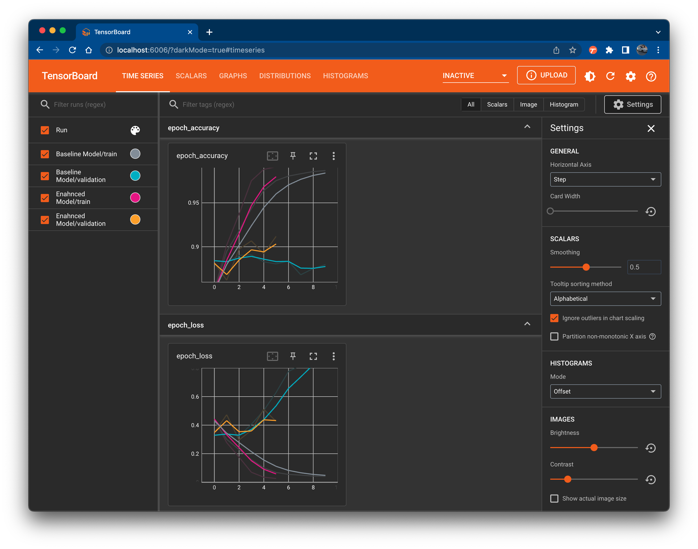

# Introduction

This repository is my personal submission as a "final exam" kind of thing for a machine learning diploma that I recently attended. 

With this side, I would like to explain what exactly is within this repo and how you could get around to downloading, running, and viewing its files. 

# What Is This

This is a 15+ GB dataset that was downloaded from Yelp. It contains the following data categories:
1. Business Information
1. User Details
1. User Reviews
1. User Tips
1. Checkin Details
1. Photos

Description for each of the above items can be viewed [here](https://www.yelp.com/dataset/documentation/main).

# Where Can I Get This Dataset?

You can download the files from [here](https://www.yelp.com/dataset). Just click on *Download Dataset* and go through the process, it's fairly easy.

# Project Structure

The project is split into the following sections and directories.

## Datasets

Under the *datasets/* folder you should have all the *.json* files stored there. Given their enormous size I excluded them from this GIT repo. Please download the datasets from Yelp, and move them to this directory.

## Jupyter Notebook

The *yelp.ipynb* notebook contains all the code used to parse the JSON files, create dataframes, dump to pickle files, and more. You will need all the packages in the requirements.txt file, so make sure you install them within your virtual environment:

`pip install -r requirements.txt`

## Python Scripts

All python scripts under *python_scripts/* were created to the pandas_profiling html files that caused the Jupyter notebook to crash multiple times. Only one is missing, and that is the one that relates to the businesses, I was able to get it to run properly from within the notebook.

## Pandas Profiling Ouput

Naturally, this item comes next. All html files under *pandas_profiling/* are the output result of pandas_profiling, whether from the notebook or python scripts.

## Plotly

I decided to geo-map the datasets using Plotly and Mapbox. All html files under *plotly_exports/* are the output result of plotly, used within the notebook.

## Tensorboard Logs

I always use Tensorboard to graph the losses and metrics of my deep learning projects. You will find al the Tensorboard graphs under the *Tensorboard Logs/* directory. You will need to run them using Tensorboard.

All you have to do is run the following command from within the main repo directory:
`Muhammads-MacBook-Pro:app sergani$ tensorboard --logdir Tensorboard\ Logs/
2023-01-28 20:44:42.626301: I tensorflow/core/platform/cpu_feature_guard.cc:193] This TensorFlow binary is optimized with oneAPI Deep Neural Network Library (oneDNN) to use the following CPU instructions in performance-critical operations:  AVX2 FMA
To enable them in other operations, rebuild TensorFlow with the appropriate compiler flags.

NOTE: Using experimental fast data loading logic. To disable, pass
    "--load_fast=false" and report issues on GitHub. More details:
    https://github.com/tensorflow/tensorboard/issues/4784

Serving TensorBoard on localhost; to expose to the network, use a proxy or pass --bind_all
TensorBoard 2.11.0 at http://localhost:6006/ (Press CTRL+C to quit)`

And then you can view the graphs through Google Chrome or any other browser:

## Models

All models go under the *models/* directory. There are two kinds of models here:
- Tensorflow Decision Forest (tfdf) models
- H5 models (Keras deep learning models)

Given the size of the H5 models I've excluded them from this repo too.

## Photos

The *photos/* directory contains all the photos received in the Yelp dataset. Initially they're all in one folder. You'll find some code within my noteboko that creates a new directory fore each photo label. Labels are found in the *photos.json* file.

## Pickle Files

The *picklejar/* directory contains all the pickle files that I generally dumped after creating the dataframes from the JSON files, cleaned them up, merged what needs to be merged, filled the NA's etc... 

Again, pickle files are huge in size given the contents of the JSON files. As a result I have excluded them from this GIT repo as well.

# Final Words

That's it I believe, if I missed anything feel free to reach out to me through the Issues section and I'll get back to you as soon as I can. 